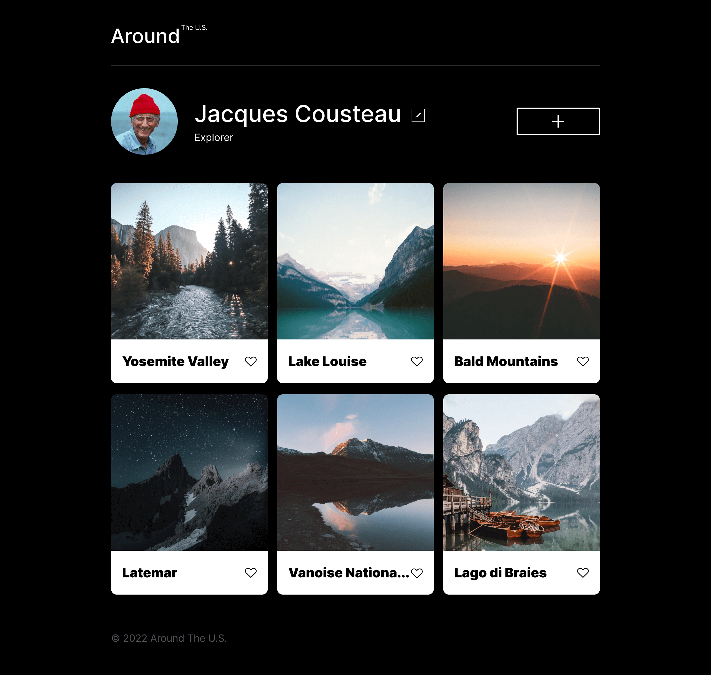
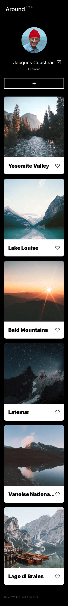

# Project 3: Around The U.S.

### Overview

Around the U.S. is my the first project using Figma, working with grid in CSS and deploying project to GitHub.

**Technologies and Techniques**

This project was made using:

- Figma
- VSCode
- GitHub
- HTML
- CSS
- Grids

**GitHub**

- [Link to the project on GitHub](https://trangmtruong.github.io/se_project_aroundtheus/)

**Images**

